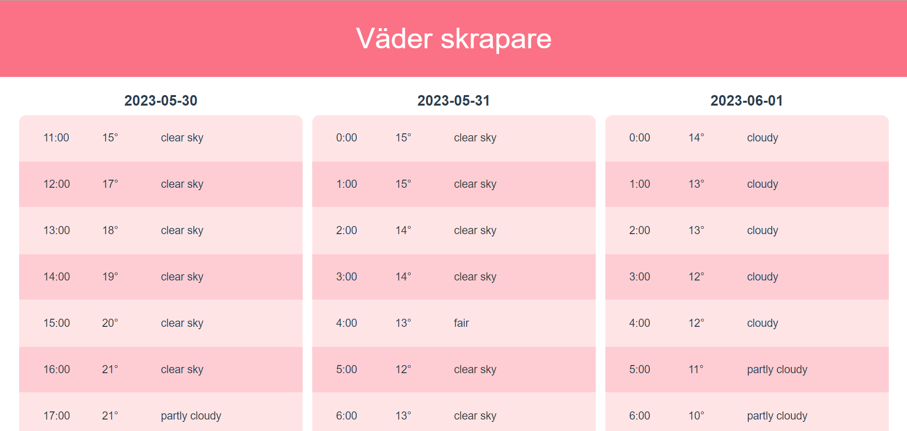

<h1 align="center"> Webscraper projekt - Väder </h1>

Detta projekt är ett webskrapnings-projekt där jag har skrapat väderwebsidan [yr.no](https://www.yr.no/en). Jag har använt node-biblioteket ['puppeteer'](https://pptr.dev/) för att skrapa sidan och [vue](https://vuejs.org/) samt [tailwindcss](https://tailwindcss.com/) för en finare presentation i form av en webbsida. 

<div style="text-align: center;">
  
</div>

## Systemkrav
- node v18
- npm v9

## Vad gör koden?
Puppeteer gör någonting som kallas "[headless browsing](https://oxylabs.io/blog/what-is-headless-browser)", vilket betyder att det inte är en människa bakom 'webbsurfandet'. Koden skrapar sidan på information och sparar ner allt i en JSON-fil. Jag kan alltså sen komma åt den datafilen i min webbsidas kod och presentera den på ett finare sätt än en .json fil.  

## Setup
Följande steg utförs i kommandoprompt

### Steg 1
Klona koden från repo `git@github.com:abbindustrigymnasium/web-scraping-med-puppeteer-abbcecek.git`

### Steg 2
Installera paketen genom att köra 
``` 
npm install
```
Vid eventuellt fel kan en clean install behövas. Detta skrivs på följande sätt:
```
npm clean-install
```

### Steg 3
För att köra programmet skriver du:
```
node index.js
```
### Steg 4
Gå till mappen `weather-scraper-vue`:
```
cd weather-scraper-vue
```
Installera paket igen:
```
npm install
```
### Steg 5
Starta en lokal webbserver:
```
npm run serve
```
Webbsidan körs då på http://localhost:8080/  
 
Om index.js körs då lokala webbservern är uppe kommer dess värden att uppdatera automatiskt.

## Roadmap
- Tester
- Installationsskript
- Uppdateringsknapp
- Grafer för visualisering
- Få tidsspann att skrapas korrekt (timmarna "`02-08`" blir bara "`02`")
- Sammanfattning av dagar man kan klicka på för att expandera
- Fler mätvärden (vind, nederbörd, luftfuktighet osv.)
- Mer bearbetad UI/UX, även göra den responsiv

## License
Detta projekt är licensierat under MIT-licens.
